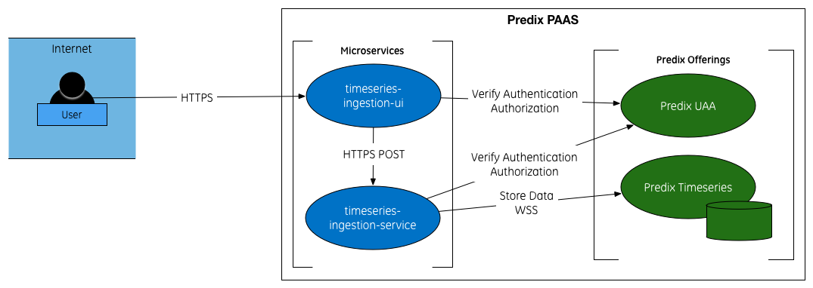

# Timeseries Ingestion UI

Timeseries Ingestion UI is the user interface for bulk uploading timeseries data using the timeseries ingestion service https://github.build.ge.com/200020939/timeseries-ingestion-service.

## Application Flow

This application is meant to make the use of the timeseries-ingestion-service easier by offering a visual solution to configure the parameters to be sent with the file to the ingestion service.

It also offers multi-file upload and queue, so it uploads and sends one file at a time.

It uses the file-upload Polymer component to handle the bulk file uploads of historical timeseries data and send the files to the timeseries-ingestion-service for the processing of the files.

  

## To Deploy the UI

Follow the steps below to deploy this application in a new environment.

### Dependencies

This application depends on the following other git projects:

- timeseries-ingestion-service - https://github.build.ge.com/200020939/timeseries-ingestion-service
- file-upload - https://github.build.ge.com/200020939/file-upload

This application use the following Predix services:

 - Predix UAA

### Clone this repo

```
git clone https://github.build.ge.com/200020939/timeseries-ingestion-ui.git
```

### Install the dependencies

```
npm install
bower install
```

### Configure the application

To configure the application to your environment, edit the file manifest.yml and add the following information:

- name: change this to the name you want to use for this application
- services: change "uaa instance name" to your uaa service instance name
- env:
 - UAA_SERVER_URL: change "uaa instance url" to your uaa service instance url
 - CLIENT_ID: change "client id" to the client id with access to your UAA instance and with access to the timeseries-ingestion-service and Predix Timeseries ingestion scope.
 - CLIENT_SECRET: change "base64 encoded of clientid:password" with you client id and secret encoded using base64 in the form of clientID:clientPassword
 - TIMESERIES_INGESTION_URL: change "timeseries-ingestion-service url" with the timeseries-ingestion-service url that you can get from deploying the service mentioned in the dependency section of this documentation.

It's recommended to create a different manifest file for different spaces/deployment environments.

### Package the application

```
grunt dist
```

### Deploy

```
cf push -f manifest.yml
```

## Local Development

In order to do local development you need to change the file connect.js located under tasks/options with the information for your UAA instance and the timeseries-ingestion-service.

Open the connect.js file and look for the uaa section, it should be around line 11. Change the clientId, serverURL and base64ClientCredential.

You can copy these values from the manifest file.

Look for the proxy section, it should be around line 24, and change the url for the timeseries-ingestion entry. You can leave the instanceId in blank but don't remove it.

After these changes you can run the application locally with grunt:

```
grunt serve
```

### Enjoy